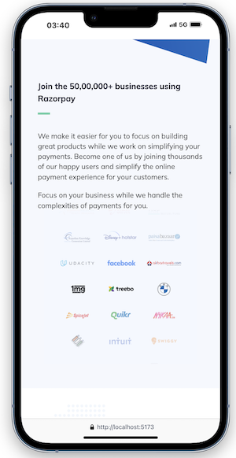

# Hey, I'm Swati Bhatt👩🏻‍💻!

# RazorPay Clone🎭

<!-- change 2 discription-->
This is a front-end clone of the Razorpay website, built for practice and to demonstrate the ability to replicate modern web designs. 

The clone mimics the layout, design elements, and overall user interface of the original Razorpay site.

[Visit Now🚀](https://swati-razorpay-clone.vercel.app/)

##  ☞Tech Stack Used 🖇️
 

##  ☞Features🧐
- Fully responsive design, adapting seamlessly to various screen sizes 
- Navigation bar, hero section, and footer styled to match the original site
- Clean and structured code with comments for clarity

## ☞Future Improvements🔮
- Adding more interactivity and dynamic features
- Backend integration for payments

##  ☞Sneak Peak 🫣

##  ☞Feedback✍🏻
I’d love to hear your thoughts on this project and would really appreciate any suggestions you have. Please feel free to reach out to me at:
get.swatibhatt@gmail.com

##  ☞Contact Me 📩
 

